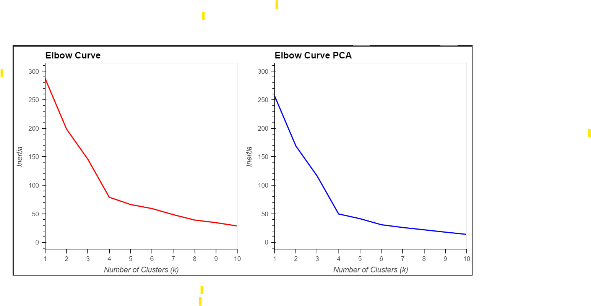

# CryptoClustering

## Project Overview
The purpose of this project is to predict if cryptocurrencies are affected by 24-hour or 7-day price changes. The approach utilizes clustering techniques to analyze and predict trends in the cryptocurrency market.

## Steps Involved

### 1. Find the Best Value for k Using the Scaled DataFrame
- First, we scale the cryptocurrency data and perform the K-means clustering algorithm to determine the optimal number of clusters.
- We plot the **Elbow Curve** to visualize the inertia values and identify the best value for `k`.

### 2. Cluster Cryptocurrencies with K-means Using the Scaled DataFrame
- After determining the optimal `k`, we perform the K-means clustering.
- The scatter plot visualizes the clusters, with the x-axis representing the "price_change_percentage_24h" and the y-axis representing the "price_change_percentage_7d".

### 3. Optimize Clusters with Principal Component Analysis (PCA)
- PCA is applied to reduce the dimensions of the data, transforming the original dataset into a 3-dimensional feature set.
- This helps to reduce noise and capture the main patterns in the data.

### 4. Find the Best Value for k Using the PCA DataFrame
- The PCA-transformed data is analyzed with the K-means clustering algorithm.
- We again plot the **Elbow Curve** with inertia values to determine the best number of clusters in the reduced feature space.

### 5. Cluster Cryptocurrencies with K-means Using the PCA DataFrame
- K-means clustering is performed again using the PCA-transformed data.
- A scatter plot is generated, where the x-axis represents **PC1** and the y-axis represents **PC2**.

### 6. Composite Plots
- **Elbow Curve Comparison**: The composite plot compares the inertia values for the scaled data and the PCA-transformed data to contrast the effect of dimensionality reduction on the clustering performance.
    

- **Cluster Plot Comparison**: The composite plot also contrasts the actual clusters formed in the scaled data versus the PCA-reduced data.
    

## Results and Analysis
- **Elbow Curve for PCA Data**: The elbow curve for the PCA data shows that with `k=4`, the inertia is 49.665, suggesting a more compact clustering.
- **Elbow Curve for Scaled Data**: For the original scaled data, with `k=4`, the inertia is 79.022, indicating more spread-out clusters.

The results show that with the PCA-transformed data, clusters tend to be tighter and more closely-knit. This suggests that reducing the number of features through PCA results in more accurate and refined clusters, as less noise is included in the data.

## Conclusion
By performing clustering analysis using both scaled and PCA-transformed data, we observed that dimensionality reduction significantly impacts the accuracy and compactness
